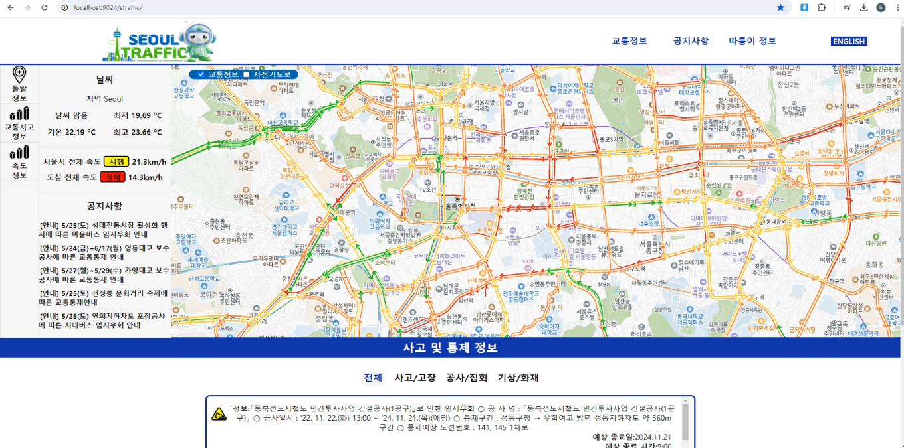
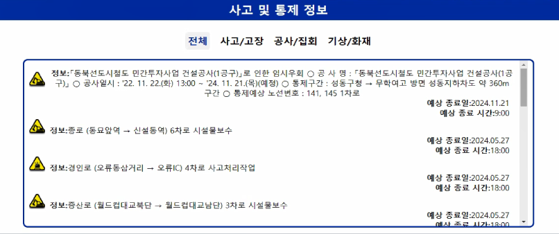
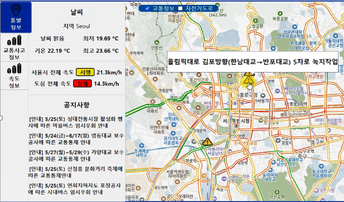
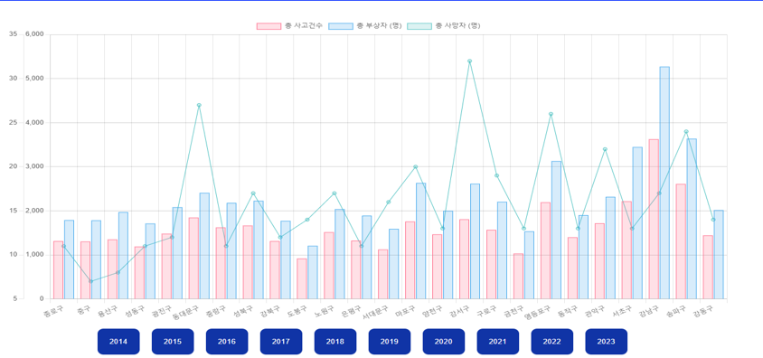
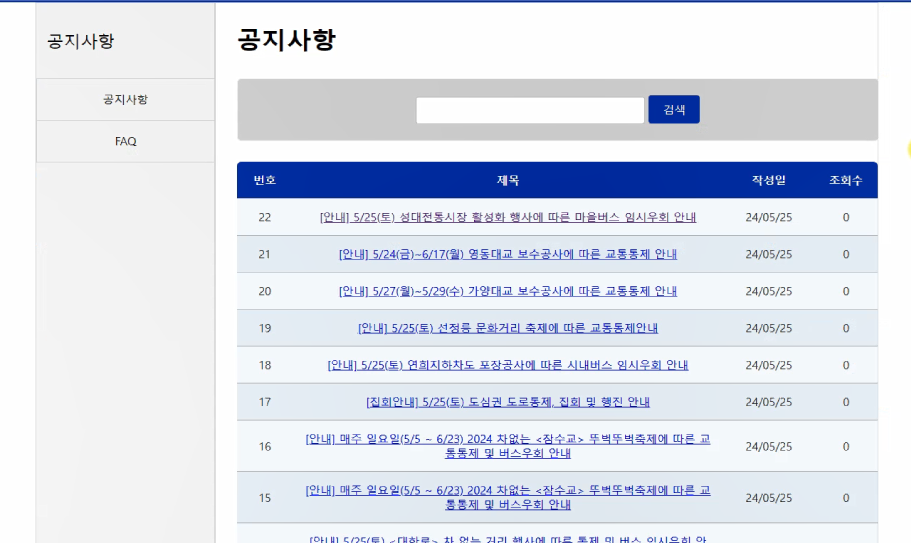

<h2>[2024] Seoul Traffic 🚗</h2>
서울시 교통사고 정보, 교통정보, 날씨 따릉이 정보 보여주는 교통지도 🗺  

 
 

 
 

## 개요
- 프로젝트 이름: Seoul Traffic (개인)
- 프로젝트 지속기간: 2024.05-2024.06
- 개발 엔진 및 언어: Spring & Java
 

## 기술 스택

### frame work

### language & Tools
      

### server 

### DBMS

 

## 담당 기능 (고객센터 파트 담당)

|||
|:---:|:---:|
|사고정보|사고정보 지도|
|||
|교통사고 chart|게시판|
 

### 공공 api 활용(XML, json) 📲
- api 활용한 실시간 교통사고 정보, 따릉이 정보 등 데이터 처리
- Db 시각화
 

### 사고 공지사항 게시판 📢
- OracleDb 활용 공지사항 게시판 제작
 

### 서울시 통행속도 정보 Sellenium 크롤링 💻
- 통행속도 정보 sellenium을 이용해 크롤링으로 데이터 처리
 

## 아쉬운점

- 서울시 통행 속도정보를 api로 처리하지 못해 크롤링을 거쳐 웹 진입하므로 로딩이 길어짐
- 전체적으로 데이터 처리를 controller에 모아두어 속도가 느려짐
